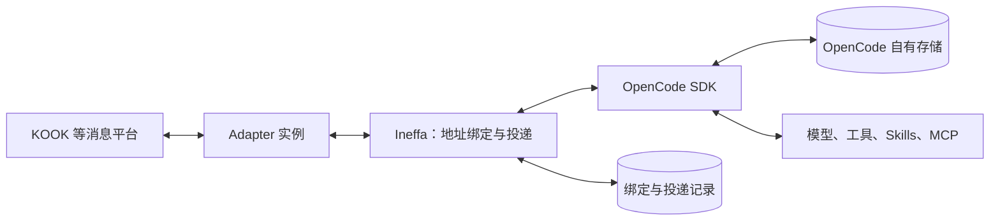

# Ineffa 架构设计

状态：0.1.0 实现基线。2026-09-15 已完成 Bun + OpenCode 2.0.3 进程内接入、WebUI 与自动化集成验证；实际 KOOK 账号及 Docker 容器运行仍待部署环境验证。运行方式见 [README.md](README.md)。

## 1. 产品模型与原则

Ineffa 是基于 Bun 和 OpenCode 的多平台 Agent 运行平台，定位接近 OpenClaw、Hermes Agent。用户在接入的消息平台中选择讨论空间、与 Agent 对话、查看协作过程；OpenCode 负责对话内部的执行。

Ineffa 是运行平台的名字，不是其上所有 Bot / Agent 的统一身份。每个平台账号有自己的显示名称、平台 ID、身份定义和职责；框架不注入“你是 Ineffa”或要求账号以 Ineffa 自称。KOOK 是官方支持的 Adapter，本文的 Guild / Channel、数字账号 ID 和 KMarkdown 均为该 Adapter 的实例，不作为其他平台的通用前提。

核心原则：**用户选择讨论空间，消息决定唤醒对象，同一个 Agent 在同一个空间里延续同一个 OpenCode 对话。**

- **简单**：路由只做身份和地址匹配，不调用模型，不判断任务类型，不自动拆解或分配工作。
- **快速**：普通消息直达 OpenCode，不固定插入记忆检索、计划、总结、反思等模型调用或工具调用。
- **可控**：上下文按用户可见的会话组织；用户可以创建、选择、结束讨论空间。
- **可靠**：复用 OpenCode 的会话、执行、持久化和恢复能力；Ineffa 只保存平台对接必须的信息。
- **可扩展**：Adapter 保留平台原生能力，不把丰富的平台 API 压缩成最低公分母。
- **多账号**：同一个 Adapter 可以创建多个独立实例；连接、账号身份和发送限流归实例所有。

第一版不内建跨对话长期记忆。Skills、文件和后续 Adapter 能力可以按需提供跨会话信息，但不成为每轮请求的必经步骤。OpenCode 的上下文压缩仍由 OpenCode 管理。

## 2. 用户看到的会话

以 KOOK 为例：

| 平台概念 | Ineffa 中的含义 |
| --- | --- |
| Guild | 一组讨论空间的容器，不自动合并其中所有频道的上下文 |
| Channel | 用户可见的对话主题与默认上下文边界 |
| Bot 账号 | 一个可以被明确 mention 的 Agent 身份 |
| Channel × Bot 账号 | 一个 Ineffa 会话，唯一对应一个 OpenCode session |

因此，同一频道中有 A、B、C 三个 Agent 时，后台有三个 OpenCode session。频道承载公开讨论，各 Agent 延续自己的执行历史；不能让三个 Agent 轮流替换同一个 session 的身份。

会话地址使用平台稳定 ID：

```text
(adapterInstanceId, conversationId) → openCodeSessionId
```

`conversationId` 由 Adapter 定义，并区分 Guild/Channel、私聊；平台支持原生子话题时，可以将其映射为独立地址。频道改名不新建 session，服务重启不新建 session，换发言人也不新建 session。第一版每个 Adapter 实例绑定一个 Agent 配置，不做消息内容驱动的 Agent 切换。

KOOK 的频道列表就是主要会话导航。新主题推荐新建频道；查看当前绑定和显式重置可以由 Adapter 提供简单命令。重置需要展示结果并保留旧 session 的可访问标识，不按时间、token 数或“话题变化”偷偷更换 session。

显式重置后，旧触发链的迟到汇报仍可在频道展示，但不自动唤醒新 session；投递记录中的原 session ID 用于识别这种情况，避免旧工作突然进入新对话。

WebUI 会话列表提供右键删除。确认后由 OpenCode 停止执行并删除原生会话，Ineffa 清理对应输入、输出记录；仅保留不可浏览的地址删除标记，阻止旧协作链重新唤醒该地址。平台消息与工作目录文件不随会话删除。

### 2.1 频道历史与模型上下文的区别

频道是信息边界，并不意味着频道中每条消息都已进入模型上下文：

- 允许频道内收到的普通消息均保存到现有入站表。未 mention 当前账号的消息标为 `observed`，不提交 OpenCode、不调用模型；下一次明确 mention 时，按平台时间将尚未提交的背景与当前提问合为一条输入。
- 每个 `频道 × Bot` 独立记录背景归属，随触发输入原子保存，重试沿用同一份内容。取消排队输入会释放其背景供下一次使用；重启保留，`/new` 不带入旧会话的背景。
- 每条消息标注显示名称、平台 ID、用户 / Bot、mention ID 和可用的引用作者、消息 ID。背景与当前提问明确分开；其他人的发言保持普通输入，不伪装成接收方自己的 assistant 消息或系统指令。
- Agent 自己的回复、工具调用和结果直接保留在其 OpenCode session 中。
- 只收录服务实际收到的频道消息，不自动请求加入前或离线期间的历史。Adapter 仍可提供显式历史读取；命令、工具 / Thinking 状态、debug 报告不作为背景。外部 Bot 的普通消息只记录，不自动唤醒。
- 不把未 mention 的闲聊逐条以 `resume: false` 塞入 OpenCode inbox：它只表示暂不唤醒，之后仍可能作为待处理输入被执行，不能等同于“只观察”。

历史补全不放在默认首字路径上；未取得的信息就明确视为未取得，不让 Agent 表现得像已经读过整个 Guild。

## 3. 最小运行结构



默认采用**一个 Bun 进程，进程内嵌入 OpenCode**。官方 v2 的 [`@opencode/sdk`](https://opencode.ai/v2/docs/build/sdk) 提供 `OpenCode.create()` 和显式关闭能力，无须额外启动 HTTP 服务。实现固定使用 `2.0.3`，并显式传入数据库路径；SDK 默认的内存数据库不用于正式服务。Docker 只是同一进程的可选打包方式。

核心只分三个模块和一个存储文件，不预先拆微服务或通用引擎框架：

| 模块 | 职责 |
| --- | --- |
| `host.ts` | Adapter 生命周期、地址绑定、入站投递、同进程公开消息转交 |
| `opencode.ts` | 封装使用到的 OpenCode 接口、消息与事件转换、升级适配 |
| `delivery.ts` | 平台回复、发送确认与失败处理；WebUI 的实时文本由 Host 转发 |
| `store.ts` | 用 `bun:sqlite` 保存绑定与投递记录 |

OpenCode 独占模型请求、工具循环、同 session 的执行协调、压缩、权限与执行恢复。Ineffa 不再建立一套 running/waiting/completed 任务状态机，不维护依赖图，也不轮询 Agent 是否“想继续”。

WebUI 的自定义提供方直接写入 OpenCode 原生 `providers` 配置，保留 JSONC 注释与其他配置，由 OpenCode 监听重载；不另建提供方数据库或模型请求代理。Agent Plan 仅是可编辑的地址预设。模型发现只在设置操作中使用标准 `GET /models`，不支持时明确报错并允许手动输入；服务端保管 Key，不向浏览器回传，也不跨地址复用保存的 Key。

第一版只支持单进程拥有这些 session。同进程 Adapter 也是可信代码，账号与 session 分开不等于操作系统隔离；不可信插件或互不信任的工作环境需要独立部署。单进程的代价是共享故障域，后续只有实测需要时才增加远程 OpenCode 连接方式。

## 4. 输入与执行

账号可通过通用 `AccountProfile.model` / `Adapter.model` 绑定 `provider/model-id`。创建原生会话时直接传入模型；已有会话在现有 `ensure` 读取中比较模型，仅有差异时调用 OpenCode `switchModel`，不另建模型路由器或缓存。保存账号配置后同步未归档会话，进行中的模型请求不取消，下一次请求使用新模型；`/new` 优先继承账号绑定。解除绑定保留已有模型，恢复会话自主选择。

一条普通消息的路径固定为：

1. Adapter 验证平台事件，提供账号、会话、消息 ID、作者、正文、附件、结构化 mention 和引用信息。
2. Host 做访问范围检查、去重和显式地址匹配，找到持久化绑定。
3. 首次使用时创建对应 OpenCode session；预先保存拟使用的 session ID，便于创建中断后对账。
4. 未 mention 的群消息只持久化。需要回复时，合并未提交背景，使用稳定的输入 ID 调用 OpenCode `session.prompt`，返回后即认为输入已被上游接收。
5. OpenCode 执行；文本事件直接交给 Adapter 显示，确认后的公开回复进入发送记录。

消息 ID 应以实例、会话和平台消息 ID 为依据生成，不能使用显示名或时间戳猜测身份。发送者和平台消息 ID 放在正常输入正文中，用于区分同名用户和引用关系；内部去重、回链字段不重复占用模型上下文。

### 斜杠命令

仅人类明确发送的命令进入控制路径，仍遵循 Adapter 访问权限与群聊 mention 规则；剥离消息首尾结构化 mention 对应的原生语法，不解析代码或引用中的命令。发给其他账号的命令和 Bot 命令文本也不作为群聊背景。

- `/new` 复用显式重置：停止旧执行、清理队列，事务内归档旧绑定、创建新绑定并记录命令去重键。恢复只完成已创建的新会话，不再重置一次；保留当前 Agent / 模型与旧历史，不调用模型。
- `/abort` 复用停止机制：中断当前执行、清空排队输入并收尾流式状态，不更换 session 或清除历史；命令不受输入队列容量限制，重复回执不会再次中断后续执行。已经完成的工具副作用不撤销。
- `/help` 仅列出本地 `/new`、`/abort`、`/help`、`/debug on|off`。不转发 `/review`、`/init` 或自定义 OpenCode 命令；未知命令直接拒绝。
- 命令输入仅保留本地去重回执，prompt 为空，不调用模型；确认、调试与状态消息只用于展示。引用已知状态/命令确认时去除该引用，引用带 debug 的回复时只保留正文。

`/debug on|off` 将会话级开关保存在绑定记录中，显式重置继承该开关。计时使用 OpenCode 官方 HTTP / tool 钩子；HTTP 钩子只在调试用 SDK instance 中注册，避免关闭调试的会话被迫改变传输方式，用户提供的 instance 配置仍保留。在模型 SSE 响应流上透传字节，收到第一个完整数据事件时记录首字（相对本轮首次请求），不等待正文、不统计心跳注释，不复制或积存响应流，取消与流错误继续向上下游传播。连接/响应头汇总最小、最大、平均值；总计和工具累计耗时按时分秒显示。请求和工具期间不额外调用模型。进程内采样在本轮结束时清理，完成报告单独落盘；平台投递与 WebUI 展示时附加，OpenCode 原始消息和 Agent 转交文本均保持不变。进程退出会丢失尚未完成的采样，报告标明采集边界，不宣称能恢复未观测到的连接或首字耗时。

### 4.1 同一个 session 如何接收新消息

**基线显式使用 `delivery: "queue"`。** 新消息等待当前执行结束，再基于更新后的会话历史处理。不同 session 仍可并发，因此 B、C 可以同时工作。

确实需要修改正在进行的工作时，用户可通过 Adapter 的明确操作选择 `steer`；停止则调用 OpenCode 的 interrupt。Ineffa 不根据自然语言自动猜测这几种模式，也不为了新消息取消并重新运行旧任务。

OpenCode v2.0.3 已定义同 session 执行协调和 `queue`/`steer` 的投递边界；具体接线以该版本契约为准，不能套用 v1 的接口名。[会话契约](https://github.com/anomalyco/opencode/blob/v2.0.3/specs/v2/session.md)

这里只需保证向上游提交的顺序。若附件解析异步完成，Host 按接收顺序串行提交同一会话的输入，不等待上一轮模型执行完成；不另建模型执行队列。

## 5. A、B、C 的异步协作

### 5.1 协作就是带地址的公开消息

A 在频道中发送“@B 做 X；@C 做 Y”，B、C 各自收到这条公开消息并开始工作。B、C 用“@A …”汇报，Host 将它们投递到 A 原来的 session。

普通回复由框架直接发送，允许 Adapter 支持平台原生 mention 语法；不要求模型为了回复或 mention 固定调用一次发送工具。需要在执行中途提前发消息、上传附件等能力时，再使用 Adapter 提供的工具。

无论文本回复还是发送工具，最终都走同一投递路径。Core 只识别 Adapter 给出的结构化 mention ID，不分析正文来决定谁应负责什么。

### 5.2 B 先完成，C 后完成

```text
A 的同一个 OpenCode session：

用户：请完成任务。
A：@B 处理 X；@C 处理 Y。
B → A：X 已完成，结果是……
A：调用工具完成 Z，工具结果保存在当前 session。
A：X 已处理，Z 已完成；收到 Y 后继续整合。
C → A：Y 已完成，结果是……
A：根据此前 X、Z 的记录与新收到的 Y 继续工作。
```

**A 知道自己做过什么，依靠的是原 session 中已经保存的执行历史。** 不需要查询额外的长期记忆，也不需要 Ineffa 把“A 已完成 Z”再总结一次。

| C 汇报到达的时间 | 行为 |
| --- | --- |
| A 已处理完 B 的结果 | 向同一个 session 追加 C 的输入，正常唤醒 |
| A 正在处理 B 的结果 | C 的输入进入 OpenCode queue；A 完成本轮后再处理 |
| B、C 几乎同时汇报 | 按接收顺序提交；同一 session 不并行启动两个 A |
| 用户显式要求立即调整当前工作 | 使用上游 `steer`，在其支持的边界纳入新输入 |

OpenCode 在后续执行步骤读取会话历史，这是上述设计成立的上游依据。[执行与历史读取契约](https://github.com/anomalyco/opencode/blob/v2.0.3/specs/v2/session.md)

A 派发后可以继续做独立工作，或结束当前回复等待后续 mention。**不要让 A 通过阻塞工具等待 B、C 的完成**，否则队列中的汇报可能得不到处理。这里的“等待”就是暂时没有新的执行，不需要专门的等待状态、join 节点或定时唤醒。

可靠性的边界也要明确：

- 已完成的工作应有普通回复、工具结果或产物记录；未表达且未持久化的内部推理不能作为恢复依据。
- 同一 session 能提供历史，不保证模型绝不忽略历史；压缩也可能损失细节。长任务可以自然地留下简短进展，但框架不硬插一次 checkpoint 工具调用。
- 如果 A、B、C 同时修改同一文件，对话串行化不会消除跨 Agent 的文件冲突。工作分工由用户和 Agent 决定，框架不增加自动合并或文件锁调度系统。

### 5.3 公开可见、只触发一次

对同一 Ineffa 进程管理的多个账号：

1. A 的消息先由平台确认发送成功，取得平台消息 ID。
2. Host 将这条已公开的消息交给同频道、有访问权限的本地 Adapter 实例，走正常入站路径。被 mention 的账号唤醒，其余只记录背景；作者自己的执行历史由 OpenCode 保留。
3. 平台之后推送的同一消息用相同身份去重，不再次唤醒。

本进程所拥有账号的网关回声只用于确认与去重，自动转交统一从确认发送的路径发起；这样即使回声比发送 API 的响应更早到达，也不会提前触发未完成的草稿。

这让本地协作不依赖“平台是否向机器人推送其他机器人的消息”。它只是已发送消息的本地转交，不传递私有推理，也不绕过频道权限。不同进程或外部机器人的互通依赖平台实际能力，不在第一版承诺范围内。

实时文本用于 WebUI 和平台展示，不触发其他 Agent。平台消息编辑合并 500 ms 内的增量；只有最新最终正文确认送达后才转交，网关草稿回声不进入其他 Agent 上下文，同一消息的编辑不重复派发。

最低限度的防循环措施属于投递层：

- 只接受授权账号/会话范围内的触发；Agent 自动互调仅接受已登记身份。
- 不因自己消息的回声唤醒自己；引用中的名字、普通 `@显示名` 不等同于平台身份。
- 每个人类触发链有一个总自动唤醒预算，覆盖全部分支；转交时继承来源，不能每次 mention 重新计数。
- 起链单位是「发给一个指定 Agent 的人类输入」。同一条平台消息直接提及多个 Agent 时，分别起链；此后各链的转交分支共享自己的预算。
- 预算耗尽时停止自动转交并在频道中说明；用户的新指令可以开启新一轮。

预算只统计已登记的投递，不记录“B 的任务完成了多少”。来源和预算使用内部 metadata，无法可靠关联的机器人消息不自行视为新的人类触发链。

## 6. Adapter：少量通用接口，保留原生能力

Adapter 是普通 TypeScript 包。第一版仅需要创建实例、启动/停止、接收规范化事件、发送消息这条闭环；编辑、附件、历史、交互卡片等通过可选能力扩展。

```text
Adapter 实例
  id / 平台账号身份 / capabilities
  start(事件接收函数) / stop()
  send(目标地址, 内容, 投递标识) → 发送结果
  edit? / readHistory? / upload?
  conversationKey?(address)：该账号可参与的共享平台会话标识
  agentPrompt? / updateProfile?：账号身份、职责与显示名称
  native：带类型的平台原生客户端
```

实际类型见 `packages/ineffa/src/types.ts`，当前通过本仓库 Bun workspace 使用，尚未发布到 npm。

账号提示词和宏展开属于通用层，所有 Adapter 使用同一 `AccountProfile` / `AgentPrompt` 契约。平台账号 ID 是不透明字符串，Core 不要求数字格式；ID 校验、共享会话判定、mention 编解码和连接凭据由对应 Adapter 负责。当前 WebUI 只内置 KOOK 连接表单是交付范围，不是平台扩展边界。

Host 仅在平台相同、双方允许访问当前地址、`conversationKey(address)` 返回相同且非空的标识时认定为同一共享会话；未实现此可选接口时不推断可协作关系。Adapter 应规范化传入地址，并为账号独占的私聊返回 `undefined`。KOOK 的实现使用 Channel ID，不按 Guild 整体分组。同一判断同时用于提示词名单和已确认消息的 mention 转交，不改变 `账号 × 平台地址` 的 OpenCode 会话绑定。

通用接口用于框架必需的路径；原生客户端供调用方直接使用平台 API。可选的 Agent 工具通过 OpenCode 官方插件接口注册，复用其工具执行和权限机制。Core 不维护第二套工具注册表、MCP 客户端或插件依赖解析器。[OpenCode 插件接口](https://opencode.ai/v2/docs/build/plugins/)

原生 API 的开发者访问不等于向模型开放全部 API。只有显式注册的工具进入模型工具集，工具根据调用 session 解析当前账号和频道，默认在此范围内工作；不能把任意跨账号发送能力作为默认工具。普通模型回复始终可以直接输出。

### 6.1 官方 `ineffa-kook`

基于指定的 [kaiheila/js-bot](https://github.com/kaiheila/js-bot)，其 README 使用包名 `@kookapp/js-sdk`。

- 每套账号创建一个 `KookClient`，复用其连接、心跳、重连和 REST 限流。
- 映射频道/私聊、作者 ID、消息 ID、引用和真实 mention；保留 KMarkdown、卡片、附件及原生客户端能力。
- 正文流式更新 KMarkdown，工具与 Thinking 分别更新独立消息；500 ms 合并窗口与消息间最小更新间隔仅作用于平台投递，不阻塞模型。输出 Token 累计本次 execution 各 step 的 output + reasoning，不包含输入和缓存；没有用量时显示 `—`。超长草稿截取前 7,500 字符，最终回复上传完整 Markdown 附件并保留原生 mention。
- 草稿与最终回复复用同一条 outbound、平台消息 ID；revision 区分已发送内容与最新内容。只有最终正文的最新版本确认送达后才转交 mention，状态消息不参与转交。创建结果未知不盲目重发，旧回声不能确认新版本编辑。
- 展示计数从 OpenCode 持久日志重建，历史事件只恢复计数，不重发完成的消息；正文增量只在内存合并，最终正文在推进日志游标前持久化。
- SDK 的 REST 方法以 `success: false` 表示多种失败，不能只捕获异常就认定发送成功。
- 已验证 Bun 中的 SDK 导入、实例化与 Adapter 协议边界。真实网关连接、重连、附件上传和配额压力仍需要实际 Bot 凭据验证。

KOOK 的 mention 和富文本使用其[原生 KMarkdown 规则](https://developer.kookapp.cn/doc/kmarkdown)，不在 Core 中引入另一套消息标记语言。

## 7. 只保存边界上的必要状态

Ineffa 使用一个本地 SQLite 文件，逻辑上只需三类记录：

| 记录 | 用途 |
| --- | --- |
| `bindings` | 平台会话地址、Agent 配置引用、OpenCode session ID、输出读取位置 |
| `inbound` | 去重键、固定输入 ID、待提交内容、上游是否已接收、来源与协作预算关联 |
| `outbound` | 源 session/消息/片段、目标账号与频道、发送内容、平台消息 ID、发送结果 |

这些表保存投递需要的正文、来源与确认，不保存工具循环或重建模型历史。第一版保留全部去重与投递身份，未实现自动清理。后续如增加保留策略，必须保留未确认记录和支持的重放窗口内的去重身份，不能仅按时间清空表。

需要保留的可靠性规则：

- **先记录，再跨边界提交。** 重试使用原 ID 和原内容，不能把同一条消息重新生成成另一条。
- 上游 v2.0.3 对同 session、同类型的重复输入 ID 采用首次接收内容；因此消息编辑要作为新修订处理，不能用旧 ID 重发后假定正文已改变。[输入去重契约](https://github.com/anomalyco/opencode/blob/v2.0.3/specs/v2/session.md)
- **输入已接收不等于执行完成，平台发送成功也不等于接收方已处理。** 状态名称保持这层区别。
- 实时事件流负责 WebUI 显示。发送路径使用固定版本的 durable session log 和持久游标，收到 `step.ended` 后读取权威消息投影，按源消息 ID 创建发送记录；断线后从游标恢复，不重新让模型回答。SDK 调用封装于 `opencode.ts`，事件解释集中于 `host.ts`。该上游接口的升级必须跑回归测试。[API 定义](https://opencode.ai/v2/openapi.json)
- 发送明确失败可按平台规则重试；发送结果不明时，先用平台 ID、回声或其他可用依据核实。无法确认则标为结果未知，不承诺跨平台 exactly-once，也不盲目重复发送带 mention 的消息。
- 入站重放窗口、pending 数量和发送重试必须有上限；达到上限要可见地拒绝或报告，不能静默丢弃。平台重连补发交给 SDK，Core 不复制其传输队列。
- 公开发送成功但尚未本地转交时崩溃，可从 `outbound` 恢复；本地接收侧用同一平台消息身份去重。

投递记录以源消息和目标地址设唯一约束；协作来源继承正在处理的输入。SQLite 事务只包含本地记录变更，网络请求在事务外执行，不尝试把平台与 OpenCode 拼成一个分布式事务。

OpenCode 已有执行恢复机制，但文档明确不保证外部工具副作用恰好发生一次。嵌入式 SDK 是否启用了所需恢复路径必须在候选版本上实测。Ineffa 不额外重放一次完整任务来“补救”。备份和升级回滚须同时考虑 Ineffa 绑定库、OpenCode 数据与工作目录。

## 8. 配置、延迟与缓存

### 8.1 配置只表达已有概念

Ineffa 配置负责 Adapter 实例及其 OpenCode Agent/工作目录引用，并提供账号级 `agentPrompt.identity`（Agent 身份）和 `agentPrompt.task`（该做什么）。模型、工具、Skills、MCP 和执行权限继续复用 OpenCode 配置。

这两项是普通文本模板：`{displayName}` 使用账号配置的显示名称，`{platformId}` 使用 Adapter 已确认的真实平台账号 ID；只做一次字面替换，不执行表达式或递归展开。两项均为空时保留 OpenCode Agent 的默认基础提示词。填写后只替换基础提示词，保留上游环境、项目指令、工具和权限机制。

一个官方 OpenCode `context` 插件在主 Agent 每次模型请求前，通过现有 session 绑定读取当前账号配置。它替换固定版本 2.0.3 的基础 system 段，并附上当前账号及同会话其他账号的 `displayName`、`platformId` 和原生 mention。名单按账号 ID 稳定排序；不包含其他账号的身份/职责文本，不依赖对方先发言或创建 session，也不自动查询全平台成员。

插件不调用模型、工具或远端 API，不维护另一份会话历史或提示词缓存。单独编辑名称和提示词只更新已持久化账号配置与当前 Adapter，在下一次模型请求生效，不重连平台、不重置 session。历史中已经存在的旧指令不被改写。配置文件账号重启后生效；重启时从账号配置和现有绑定重建插件行为。标题、压缩和其他辅助请求继续使用 OpenCode 原有流程。

最小配置是普通代码；WebUI 可直接管理常用连接。配置文件示例：

```ts
import { kook } from "ineffa-kook";

export default {
  adapters: [
    kook({
      id: "kook-main",
      token: process.env.KOOK_TOKEN!,
      agent: "build",
      directory: "./workspace",
      channels: ["替换为真实频道 ID"],
    }),
  ],
}
```

新增账号就是新增实例。访问范围和资源上限有可检查的默认值与少量高级选项，不要求用户先理解 pipeline、memory provider、scheduler、router 才能聊天。配置错误在启动时指出具体位置，不静默回退到别的模型或账号。

### 8.2 默认请求路径不做额外推理

- 常驻一个 OpenCode host；按首次使用创建 session，按需加载可选 Adapter 能力。
- 不为消息分类、长期记忆检索、协作状态整理额外调用模型。
- 不设置等待“用户也许还会发一句”的静默窗口；收到可投递消息就提交。
- 不在每轮前自动拉取全频道历史或扫描全部 Skills。
- 只对平台输出做必要的节流，不阻塞 OpenCode 消费文本事件；平台不支持编辑时降级为分段或最终发送。

分别测量启动就绪时间、入站到上游接收、上游接收到首个文本、首个文本到平台可见四段延迟。缓存命中等模型侧指标由上游可用数据统计，缺失时显示未知，不编造固定首字保证。

### 8.3 尽量保留模型缓存

保持同一 session、稳定的模型/Agent 配置及工具定义，不每轮重建历史或切换提供方；动态作者、消息和频道状态追加在输入尾部，不反复改写提示词前缀。配置有实质变化时让用户明确知道生效边界。

压缩、模型切换、提供方缓存过期和上游实现仍可能影响缓存。Ineffa 不实现自己的 KV cache 或提示词压缩层，也不承诺长期 100% 命中。

## 9. 兼容性与上游升级

严格 semver；同一 major 内，Ineffa 已发布的配置与 Adapter 稳定接口不删除、不标记弃用、不增加必填项，既有默认路由、投递语义和权限默认值不暗改。新增功能默认不改变旧配置的行为。

“相同输入行为一致”的承诺约束 **Ineffa 明确规定的确定性行为**。它无法覆盖模型输出、第三方平台、外部工具副作用或上游非确定性行为；不能把这些包装为可保证的兼容性。修复偏离书面契约的错误要记录影响；改变契约则进入 major。

OpenCode 与 KOOK SDK 固定精确版本并提交依赖锁文件，不在服务启动时自动追随 latest。定期验证新版本，通过接入验收后随 Ineffa 发布。上游差异限制在接入模块内，避免维护长期 fork，也不向稳定 Adapter 接口泄漏上游实验性类型。

升级前备份；如果上游存储迁移不可逆，回滚必须恢复配套数据，不能仅替换旧二进制。每次发布写明已验证的 Bun/OpenCode/KOOK SDK 组合。第一版优先依赖少、行为明确，而非宣称兼容所有历史版本。

## 10. 最小实现顺序与验收

1. **验证上游闭环**：在 Bun 中创建 host/session，发送、排队、流式读取、停止、重启恢复；确认版本契约。
2. **一个 KOOK 账号**：频道/私聊映射、明确 mention 触发、普通回复、重连去重。
3. **三个账号的公开协作**：验证下面的 A/B/C 场景，补齐投递确认与防循环。
4. **固化稳定接口**：依据真实使用整理 Adapter API、最小配置和升级检查，再扩展平台能力。

发版前验证这些架构性质：

- B 先完成、C 后完成；C 在 A 执行中到达；两者同时到达：A 的 session ID 不变，后续模型输入包含此前工作的已保存记录。
- A 发出 mention 后退出本轮，B/C 汇报仍能正常唤醒；不靠阻塞等待或周期性模型调用。
- 平台回声、本地转交、断线重放同时出现，同一输入只被接收一次；多账号不会串私聊或串 session。
- 流式草稿不唤醒其他 Agent；发送失败或结果未知不会被报告为派发成功。
- 在输入提交、回复发送和本地转交的关键间隙重启，能对账并显示无法确认的状态；不宣称重复副作用已经被消除。
- 上游实时流中断后能从持久消息恢复发送；对话压缩后仍延续原 session。
- 普通消息没有固定的记忆工具调用、预处理模型调用或人为等待窗口；Bun 与 KOOK SDK 的连接、上传、发送和退出可用。

**完成标准：用户能够围绕频道管理对话，让多个 Agent 通过公开 mention 连续协作；Ineffa 自己只理解地址、消息和投递结果。**

### 10.1 当前交付与验收边界

- 已实现：进程内 SDK、持久绑定、queue / steer 接线、独占数据目录、公开消息确认、同进程 mention 转交、协作预算与重置边界。
- WebUI：会话创建 / 搜索 / 归档 / 重置 / 改名 / 模型切换、实时文本、排队输入操作、权限与表单回复、模型 Key 连接、KOOK 账号管理和投递核实。
- 自动化测试实际驱动 OpenCode 的模型请求与工具执行，检查 A/B/C 汇报顺序、后续上下文、重复输入、恢复与发送确认。测试模型服务在本机，平台发送边界使用可控 Adapter。
- 待真实部署验收：KOOK 网关与回声、平台限流 / 网络故障、Docker 镜像及长时间稳定性。架构和单次测试不等于已经证明长期无故障。
- 不包含：跨进程 Agent 互调、自动长期记忆、全频道历史自动灌入、多租户权限系统、自动数据清理。扩展应继续保持默认输入路径简单。
